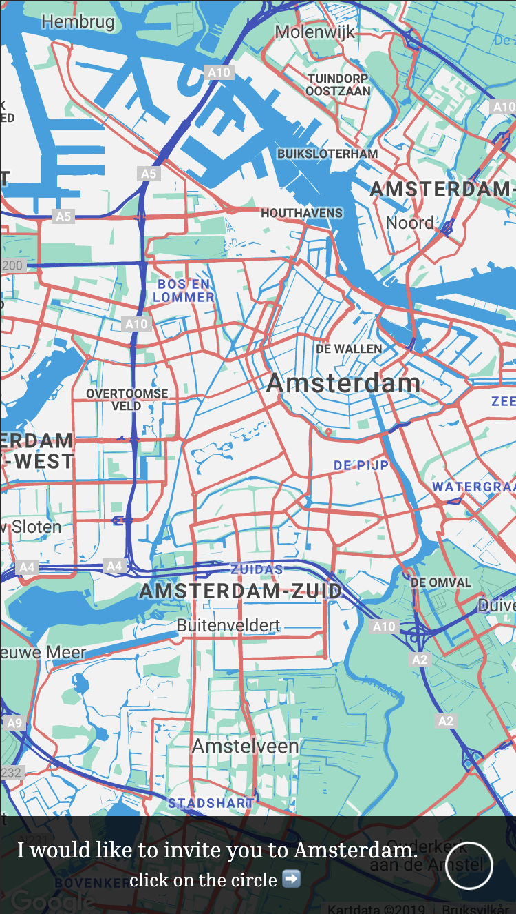
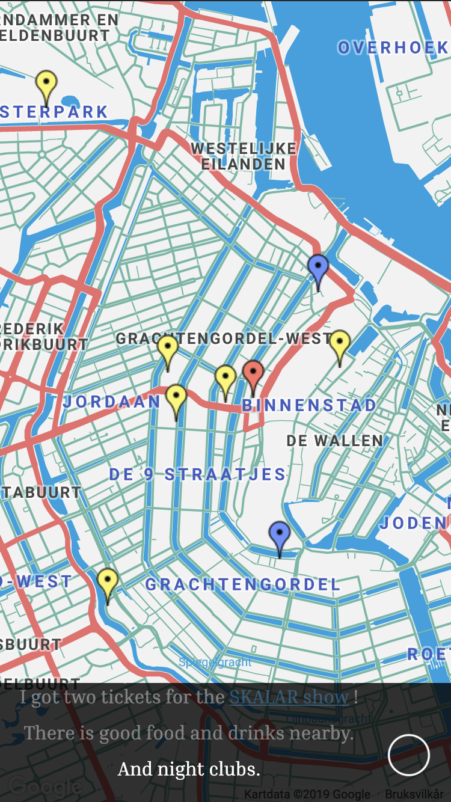

# Google maps invitation

> A demo of react-google-maps as an invitation for travelling.

| Initial screen | Markers | 
| --- | --- |
|  |  |

Built with React, [styled-components](https://www.styled-components.com/), 
[react-google-maps](https://tomchentw.github.io/react-google-maps/) and a 
motivation for providing a christmas present 🎄🎁 (a trip to Amsterdam) 
via a website.

## Developing

This repository requires you to have an API-key for Google Maps. You can generate
one at the [Google console](https://console.developers.google.com/apis/dashboard). 

### Setup

```
git clone git@github.com:tomfa/react-google-maps-demo.git
yarn
```

*Then add your [Google Maps API key](https://console.developers.google.com/apis/dashboard) 
to `components/GoogleMaps/config.js`*

### Modify

The map and text updates in a "step". 
You can add or remove steps, text and markers by editing `src/data/steps.js`.

```js
step("The flight lands Thursday the 16th, at 17:25.")
```

You may optionally choose zoomLevel, change location or add markers for each step. 

```js
step("The flight lands Thursday the 16th, at 17:25."), {
  mapCenter: { lat: 52.3105386, lng: 4.7660857 },
  zoomLevel: 13,
  markers: [
    {
      label: "Schiphol Amsterdam Airport",
      location: { lat: 52.3105386, lng: 4.7660857 }
    }
  ]
})
```

### Run

```
yarn start
```

### Test

```
yarn test
```

### Deploy

```
yarn deploy
```

By running the deploy command, your `origin/gh-pages` branch is 
pushed containing an updated version of the built application.
